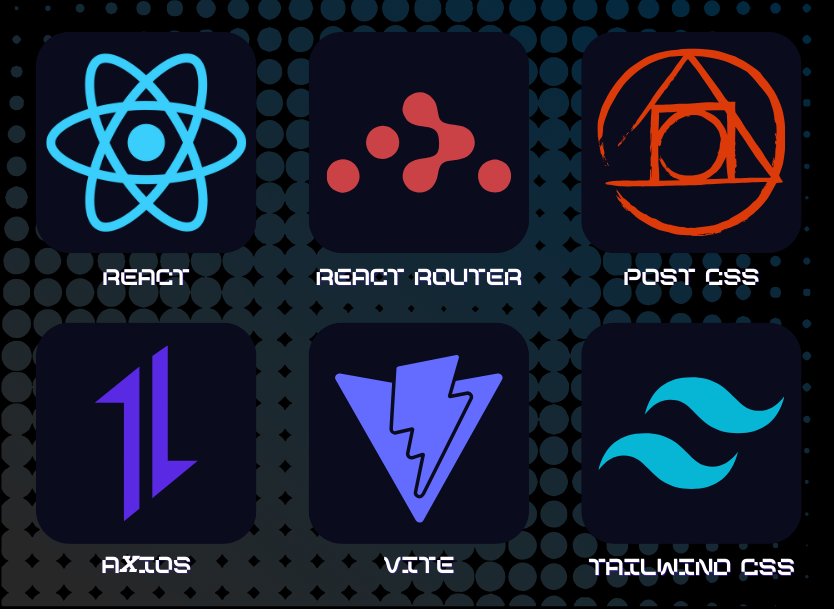

<div align="center">
<h1 align="center">
EchoView
</h1>
  
</div>

### ✨ TEAM MEMBER
<table>
  <tbody>
    <tr>
      <td align="center"><a href="https://github.com/"><br /><sub><b>PM/BE | 유채민</b></sub></a><br /></td>
      <td align="center"><a href="https://github.com/jeonghyeonmin1"><br /><sub><b>FE | 정현민</b></sub></a><br /></td>
      <td align="center"><a href="https://github.com/song-hae-in"><br /><sub><b>BE | 송해인</b></sub></a><br /></td>
      <td align="center"><a href="https://github.com/SPIDEY1876"><br /><sub><b>FE | 김동언</b></sub></a><br /></td>
  </tbody>
</table>
<br>

1. [프로젝트 소개](#프로젝트-소개)
2. [팀원 소개](#-team-member)
3. [서비스 화면](#서비스-화면)
4. [기술 스택](#기술-스택)
5. [시스템 아키텍쳐](#시스템-아키텍쳐)
6. [설치 및 실행 방법](#설치-및-실행-방법)
7. [주요 기능](#주요-기능)
7. [명세서](#📝-명세서)

## 프로젝트 소개

### 📌 한 줄 소개  
LLM 기반 AI 면접 서비스로, 직업·전공별 맞춤 질문과 실시간 피드백을 제공하는 인터뷰 플랫폼입니다.

### 📖 상세 설명  
LLM을 사용하는 면접 서비스로, 사용자가 선택한 직업 또는 전공 분야에 맞춰 실제 면접과 유사한 질문을 제공합니다. 
사용자는 질문에 답변한 후, AI가 제공하는 **평가**와 **개인화된 피드백**을 받을 수 있습니다.  
또한 **카카오 로그인**, **프로필 관리**, **인터뷰 기록 저장** 등 실제 서비스 수준의 **사용자 경험(UX)**을 지원합니다.

## 서비스 화면

- Home: 서비스 소개 및 면접 시작
- SelectJob: 분야/직업 선택

- Interview: 직업별 면접 진행, 답변 입력, 진행률 표시
- Result/Profile: 내 정보, 인터뷰 내역, 피드백

- Sign In/Sign Up: 카카오 로그인 및 회원가입


## 기술 스택
### - Frontend

### - Backend

- React (CRA 기반)
- React Router
- Context API (전역 상태 관리)
- Styled CSS (프리미엄 UI)
- 카카오 로그인 연동 (SDK/REST API)

## 시스템 아키텍쳐

---

> 본 프로젝트는 실제 LLM 기반 면접 서비스의 프론트엔드 MVP 예시입니다. 추가 기능 및 백엔드 연동은 확장 가능합니다.

##  설치 및 실행 방법

### 0) 사전 준비
- **Node.js** ≥ 18, **npm** ≥ 9?
- **Python** ≥ 3.10, **pip**
- (선택) PostgreSQL / MySQL (개발용은 SQLite 가능)

---

### 1) 프론트엔드 (React + Vite)

```bash
# 1) 저장소 클론
git clone https://github.com/Nurse-Interview-Service/front.git
cd front

# 2) 의존성 설치
npm install

# 3) 데모
npm start
``` 

##  주요 기능

### 1. 직업·전공 맞춤 인터뷰
- 사용자가 선택한 **직업** 또는 **전공 분야**에 따라 맞춤형 면접 질문 생성
- 실시간 대화형 면접 진행 (질문 → 답변 → 다음 질문)

### 2. 실시간 음성 인식(STT) & 음성 합성(TTS)
- 마이크를 통한 실시간 음성 입력 인식
- 인식된 텍스트 자동 표시 및 서버 전송
- 면접관 질문을 **음성**으로 재생 (TTS 지원)

### 3. AI 피드백 & 점수 평가
- 사용자의 답변을 AI 면접관 이 분석하여 **평가 점수**와 **피드백** 제공
- 논리성, 구체성, 직무 적합성 등 항목별 점수 시각화
- 개선할점 과 모법 답안 제공

### 4. 인터뷰 기록 관리
- 면접 종료 후 **결과 저장**
- 프로필 페이지에서 과거 인터뷰 내역 및 피드백 확인 가능

## 📝 명세서

### [API 명세서](https://www.notion.so/API-23b1b52e7b3e8072a611c0ba3bce8d96?source=copy_link)